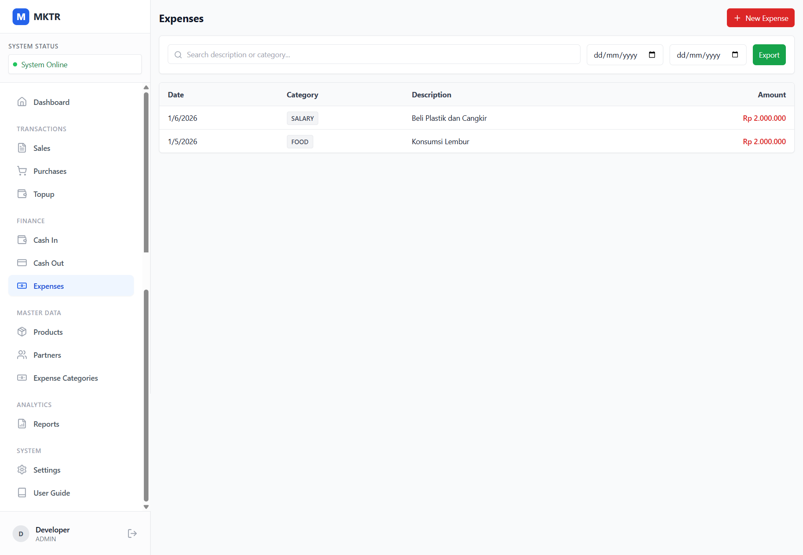
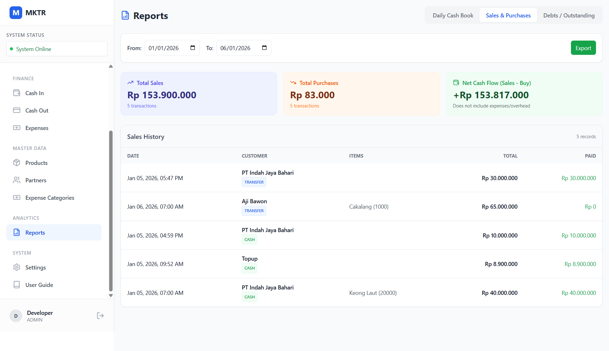

# Proposal Penawaran Aplikasi Bakul Iwak (TraderPOS)

## 1. Pendahuluan
Dalam bisnis perdagangan komoditas yang bergerak cepat, pencatatan manual seringkali menjadi hambatan utama. Resiko kesalahan hitung, kehilangan data, dan kesulitan memantau arus kas dapat menghambat pertumbuhan bisnis Anda.

**Bakul Iwak (TraderPOS)** hadir sebagai solusi aplikasi kasir dan manajemen bisnis yang dirancang khusus untuk pedagang komoditas. Aplikasi ini mengutamakan kecepatan, kemudahan penggunaan, dan kemampuan bekerja tanpa internet (Offline-First), memastikan operasional Anda tidak terganggu oleh kendala sinyal.

*Tampilan Dashboard Utama yang Ringkas dan Informatif*

---

## 2. Fitur Unggulan

Aplikasi ini mencakup fitur-fitur esensial untuk mengelola operasional harian Anda secara efisien:

### A. Transaksi & Kasir (POS)
*   **Pembelian (Inbound):** Catat pembelian komoditas dari petani/supplier dengan cepat. Sistem otomatis menghitung total harga berdasarkan berat dan harga satuan.

*   **Penjualan (Outbound):** Proses penjualan ke pelanggan dengan struk digital. Sistem otomatis menghitung total harga berdasarkan berat dan harga satuan.

*Antarmuka Kasir Pembelian yang Cepat dan Mudah*
*   **Manajemen Hutang Piutang:** Pantau pembayaran parsial. Jika pembayaran kurang dari tagihan, sistem otomatis mencatatnya sebagai hutang/piutang yang bisa dilacak.

### B. Master Data
*   **Master Produk:** Kelola daftar komoditas, harga beli, dan harga jual yang fleksibel.

*Manajemen Master Data Produk*

*   **Master Partner:** Database lengkap supplier (petani) dan pelanggan Anda.

*Manajemen Master Data Partner*

### C. Manajemen Keuangan
*   **Arus Kas (Cash Flow):** Pantau uang masuk (Modal, Topup) dan uang keluar (Operasional) secara real-time.
*   **Pencatatan Biaya:** Rekam pengeluaran operasional harian (Bensin, Makan, Plastik, dll) dengan kategori yang bisa disesuaikan.
*   **Keamanan Kas:** Sistem sesi kasir untuk memastikan uang fisik di laci cocok dengan catatan sistem saat tutup buku.

*Pencatatan Biaya Operasional Harian*

### D. Laporan & Analisa
*   **Laporan Harian:** Ringkasan omzet, laba kotor, dan pengeluaran per hari.
*   ***Laporan Kas Harian:*** Ringkasan arus kas per hari, termasuk modal, topup, dan pengeluaran operasional.

*Laporan Kas Harian dan Fitur Ekspor Excel*

*   ***Laporan Penjualan & Pembelian:*** Ringkasan omzet, laba kotor, dan pengeluaran per hari.

*Laporan Penjualan dan Fitur Ekspor Excel*

*   **Ekspor Excel:** Semua data laporan bisa diunduh ke format Excel (.xlsx) untuk analisa lebih lanjut atau pembukuan bulanan.

*Laporan Harian dan Fitur Ekspor Excel*

### E. Teknologi Handal
*   **Offline-First:** Tetap bisa transaksi lancar meski tidak ada internet. Data akan tersimpan aman di perangkat.
*   **Ringan & Cepat:** Berbasis Web App (PWA), bisa diinstal di HP Android, Tablet, atau Laptop tanpa memberatkan kinerja perangkat.

---

## 3. Paket Penawaran

Kami menawarkan dua skema solusi yang disesuaikan dengan skala bisnis Anda:

### 📦 Paket BASIC (Personal / Single Store)
Cocok untuk pedagang mandiri atau toko tunggal yang ingin beralih dari pencatatan kertas ke digital.

*   **Fitur:** Semua fitur di atas (POS, Keuangan, Laporan).
*   **Perangkat:** Single Device (1 HP/Tablet/Laptop).
*   **Penyimpanan Data:** Lokal di perangkat.
*   **Backup:** Backup data otomatis ke **Google Sheets** (Spreadsheet) pribadi Anda saat online. Data aman dan mudah diakses dari mana saja via Google Drive.
*   **Biaya:** ~~Rp 900.000~~ **Rp 650.000** (Sekali Bayar).

### 🚀 Paket PRO (Growing Business)
Cocok untuk bisnis yang memiliki beberapa admin, kasir, atau pemilik yang ingin memantau dari jauh.

*   **Fitur:** Semua fitur BASIC + Fitur Kolaborasi.
*   **Perangkat:** **Multi-Device Sync**. Gunakan di banyak perangkat sekaligus (misal: Admin di Gudang, Owner di Rumah, Kasir di Toko).
*   **Sinkronisasi Real-time:** Data antar perangkat terhubung via Cloud Server khusus. Transaksi yang diinput kasir langsung muncul di HP Owner detik itu juga.
*   **Manajemen User:** Hak akses berbeda untuk Owner (Full Akses) dan Kasir (Terbatas).
*   **Support:** Prioritas support teknis.
*   **Biaya:** ~~Rp 1.225.000~~ **Rp 975.000** (Sekali Bayar).
**+Biaya Per Tahun: Rp 300.000*

### Harga

- Paket BASIC: ~~Rp 900.000~~ **Rp 650.000** (Sekali Bayar)
- Paket PRO: ~~Rp 1.225.000~~ **Rp 975.000** (Per Tahun)

---

## 4. Perbandingan Fitur

| Fitur | Paket BASIC | Paket PRO |
| :--- | :---: | :---: |
| Transaksi Jual Beli | ✅ | ✅ |
| Manajemen Hutang Piutang | ✅ | ✅ |
| Laporan Harian & Excel | ✅ | ✅ |
| Mode Offline (Tanpa Sinyal) | ✅ | ✅ |
| **Backup Data** | Google Sheets (Pribadi) | Cloud Database (Dedicated) |
| **Jumlah Perangkat** | 1 Perangkat | **Unlimited / Multi-Device** |
| **Sinkronisasi Data** | Manual / Auto ke GSheet | **Real-time Antar HP** |
| **Akses Owner Jarak Jauh** | Via GSheet | Via Aplikasi Langsung |

---

## 5. Penutup

Jangan biarkan pencatatan manual menghambat potensi keuntungan Anda. Beralihlah ke **Bakul Iwak (TraderPOS)** sekarang untuk operasional yang lebih rapi, transparan, dan menguntungkan.

Hubungi kami untuk demo aplikasi dan konsultasi paket yang paling tepat untuk bisnis Anda.

**[Nama Perusahaan / Kontak Anda]**
[Nomor Telepon / WhatsApp]
[Email]