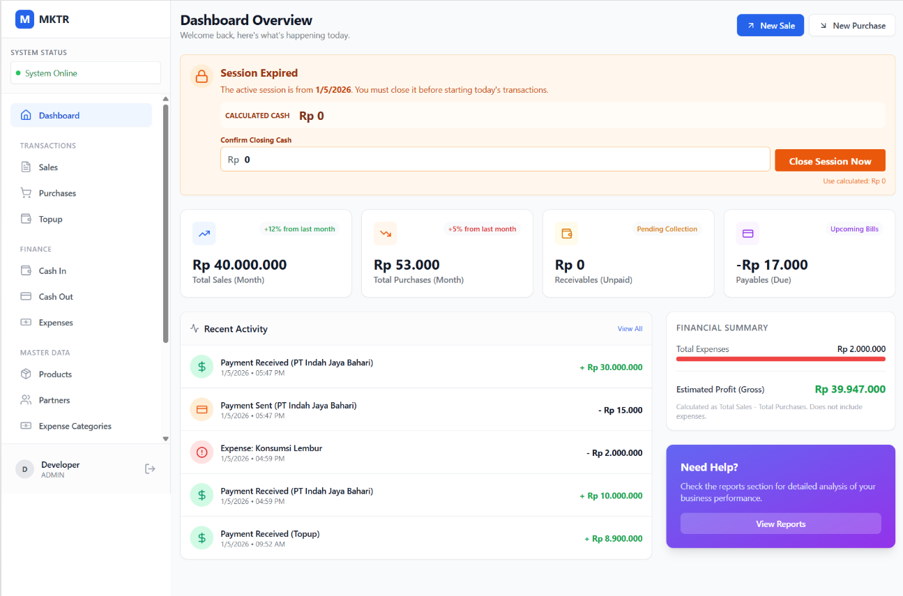
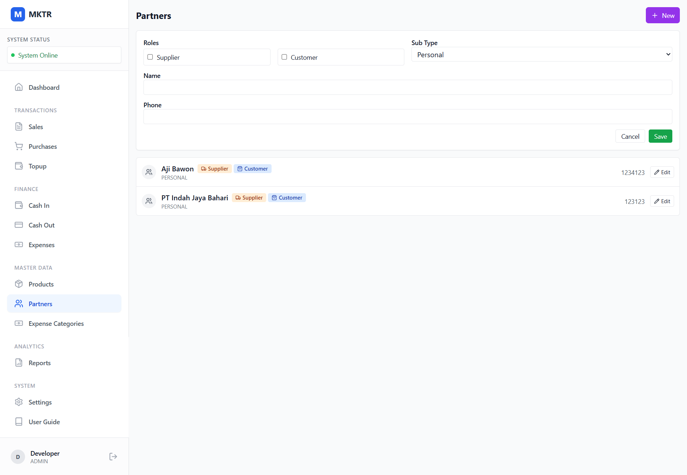
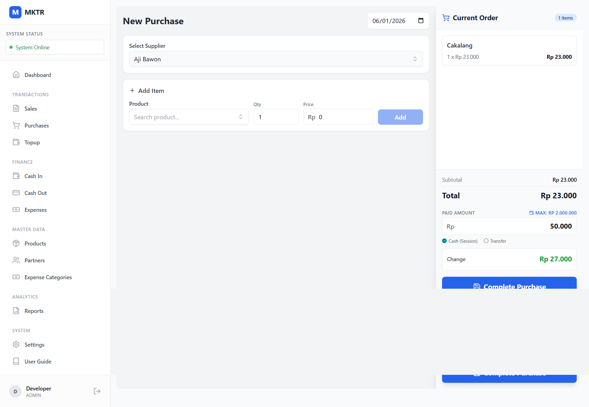

# Bakul Iwak (TraderPOS) - User Manual

Welcome to the **Bakul Iwak** (TraderPOS) User Manual. This guide will help you navigate and use the application effectively for your commodity trading business.

**Note:** This manual includes placeholders for screenshots. Please take screenshots of your actual application and save them in the `screenshots` folder with the filenames indicated (e.g., `login.png`).

---

## Table of Contents
1. [Getting Started](#1-getting-started)
2. [Dashboard](#2-dashboard)
3. [Master Data Management](#3-master-data-management)
4. [Transactions](#4-transactions)
5. [Cash Management](#5-cash-management)
6. [HRIS & Payroll](#6-hris--payroll)
7. [Reports](#7-reports)
8. [Settings & Sync](#8-settings--sync)

---

## 1. Getting Started

### Login
To access the system, you must log in using your assigned user profile and PIN.

1.  Select your **User Name** from the dropdown menu.
2.  Enter your **4-digit PIN**.
3.  Click **Login**.

*Figure 1: Login Screen*

---

## 2. Dashboard

After logging in, you will see the Dashboard. This gives you a quick overview of your business performance.

**Key Metrics:**
*   **Today's Sales**: Total value of sales made today.
*   **Today's Purchases**: Total value of commodities bought today.
*   **Cash Balance**: Current calculated cash on hand.
*   **Pending Sync**: Number of items waiting to be uploaded to the server.

*Figure 2: Main Dashboard*

---

## 3. Master Data Management

Before making transactions, ensure your master data is set up. Navigate to the **Master Data** section in the sidebar.

### Products
Manage the commodities you buy and sell.
*   **Add Product**: Click `+ New Product`, enter Name, Unit (kg, pcs), Category, Buying Price, and Selling Price.
*   **Edit/Delete**: Use the icons next to each product.

*Figure 3: Product List*

### Partners
Manage your Suppliers (Farmers) and Customers.
*   **Add Partner**: Click `+ New Partner`.
*   **Type**: Select 'Supplier' for people you buy from, 'Customer' for people you sell to.

*Figure 4: Partner List*

### Expense Categories
Manage custom categories for your operational expenses.
*   **Add Category**: Click `+ Add Category` and provide a name (e.g., "Electricity", "Packaging").
*   **Active Status**: Toggle categories on or off.

*Figure 5: Expense Categories*

---

## 4. Transactions

### Purchases (Inbound)
Record commodities bought from suppliers.
1.  Go to **Transactions > Purchases**.
2.  Click `+ New Purchase`.
3.  Select **Supplier**.
4.  Add **Items** (Select Product, enter Quantity). Price defaults to the master buying price but can be changed.
5.  Enter **Paid Amount**. If you pay less than the total, the system records a debt.
6.  Click **Submit**.

*Figure 6: New Purchase Form*

### Sales (Outbound)
Record commodities sold to customers.
1.  Go to **Transactions > Sales**.
2.  Click `+ New Sale`.
3.  Select **Customer**.
4.  Add **Items** (Select Product, enter Quantity).
5.  Enter **Paid Amount**.
6.  Click **Submit**.

*Figure 7: New Sales Form*

---

## 5. Cash Management

Manage your daily cash flow securely.

### Cash In / Top Up
Record money added to the drawer (e.g., Capital injection, withdrawal from bank).
*   Go to **Finance > Cash In** or **Transactions > Topup**.
*   Enter amount and description.

### Expenses
Record operational costs.
1.  Go to **Finance > Expenses**.
2.  Click `+ New Expense`.
3.  Select a **Category** (from your Master Expense Categories).
4.  Enter Amount and Description.
5.  Click **Save**.

*Figure 8: Expense List*

---

## 6. HRIS & Payroll

Manage employee attendance and salaries.

### Attendance
Employees can clock in/out or Admin can manage records.
*   Go to **HRIS > Attendance**.
*   **Check In/Out**: Click the button to record time.
*   **Admin Mode**: Admins can manually add attendance records for employees.

*Figure 9: Attendance Screen*

### Payroll
Generate and pay salaries.
1.  Go to **HRIS > Payroll**.
2.  Select **Period** (Start/End Date).
3.  Click **Generate Payroll**. The system calculates salary based on attendance and settings.
4.  Review the list and click **Pay All** to record the salary expense.

*Figure 10: Payroll Generation*

---

## 7. Reports

View detailed financial reports and export them to Excel.

1.  Go to **Analytics > Reports**.
2.  **Tabs**:
    *   **Daily**: Summary of cash flow for a specific day.
    *   **Sales & Purchases**: Detailed lists of transactions.
    *   **Debts**: Outstanding payments to suppliers or from customers.
3.  **Export**: Click the **Export** button (Green button) to download the data as an `.xlsx` (Excel) file.

*Figure 11: Reports & Export*

---

## 8. Settings & Sync

Configure the application and server connection.

1.  Go to **System > Settings**.
2.  **Company Info**: Update your company name and address.
3.  **Server Sync**: Enter your **API URL** (Google Apps Script URL) to enable cloud sync.
4.  **Google Client ID**: View or set the OAuth Client ID for Google integration.
5.  **License**: Verify your application license key.

*Figure 12: Settings Page*

---

### Offline Mode
Bakul Iwak works offline! You can continue recording transactions without internet.
*   Data is saved locally on your device.
*   When internet returns, the system automatically attempts to **Sync** data to the server.
*   Check the **Sync Status** icon in the dashboard or lists (Green Check = Synced, Gray Clock = Pending).
